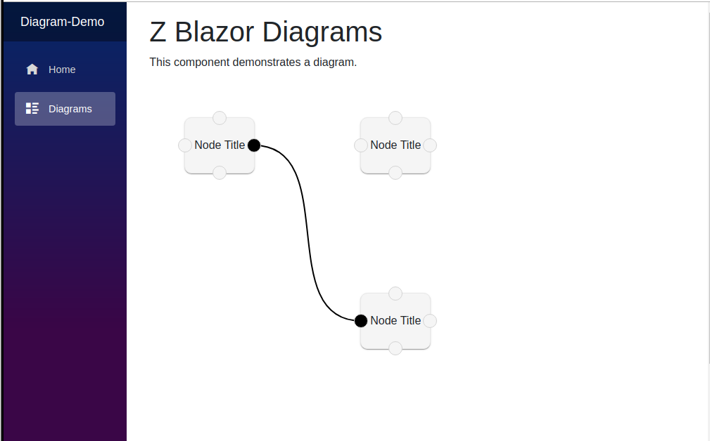

# Setting up [Z.Blazor.Diagrams](https://github.com/Blazor-Diagrams/Blazor.Diagrams)
This is an amazing diagramming library for _Blazor_ but there is no minimal, **working**
integration example.  The 'quick start guide' is both incorrect and omits several important steps.



## Installation
Generally based on the [quick start guide](https://blazor-diagrams.zhaytam.com/quickstart)
but without the missing bits.

### Host Page
`Pages/_Host.cshtml`
```html
<head>
  <!-- ... -->
    
  <!-- in the head element -->
  <link href="_content/Z.Blazor.Diagrams/style.min.css" rel="stylesheet"/>
    
  <!-- if you want the default styling -->
  <link href="_content/Z.Blazor.Diagrams/default.styles.min.css" rel="stylesheet"/>
</head>

<body>
  <!-- in the body element -->
  <script src="_content/Z.Blazor.Diagrams/script.min.js"></script>
  
  <!-- ... -->
<body>
```

### Styling
`wwwroot/css/site.css`
```css
/* make sure DiagramCanvas takes up all of parent's space */
.diagram-container {
    width: 100%;
    height: calc(100% - 52px);
}
```

## Display Diagram
`Pages/Diagrams.razor`
```html
@using Blazor.Diagrams.Core
@using Blazor.Diagrams.Core.Geometry
@using Blazor.Diagrams.Core.Models

<!-- required to resolve DiagramCanvas component -->
@using Blazor.Diagrams.Components

<!--
Parent of DiagramCanvas has to have a fixed width/height
or it will not be rendered.

100vw = 100% viewport width
100vh = 100% viewport height
-->
<div style="width:100vw; height: 100vh">
  <CascadingValue Value="Diagram">
    <DiagramCanvas></DiagramCanvas>
  </CascadingValue>
</div>
```


